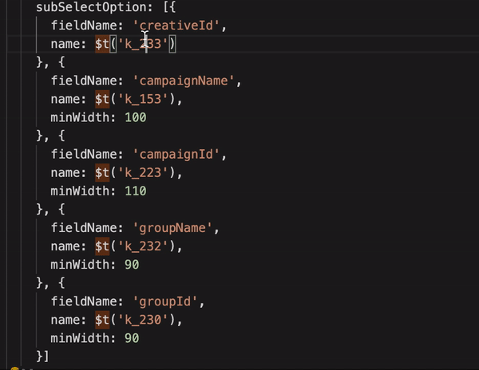

# translate-tips README

Show translated text for develop convinience.

## Features

* Show tips hover on specific text;

## Extension Settings

This extension contributes the following settings:

* `translate-tips.localeFilePath`: absolute path of locale file, support .js、.json、.jsx, .ts、.tsx file
* `translate-tips.keyReg`: pattern to match word need show tips, default value is `*`

## Known Issues

## Release Notes

**Enjoy!**
